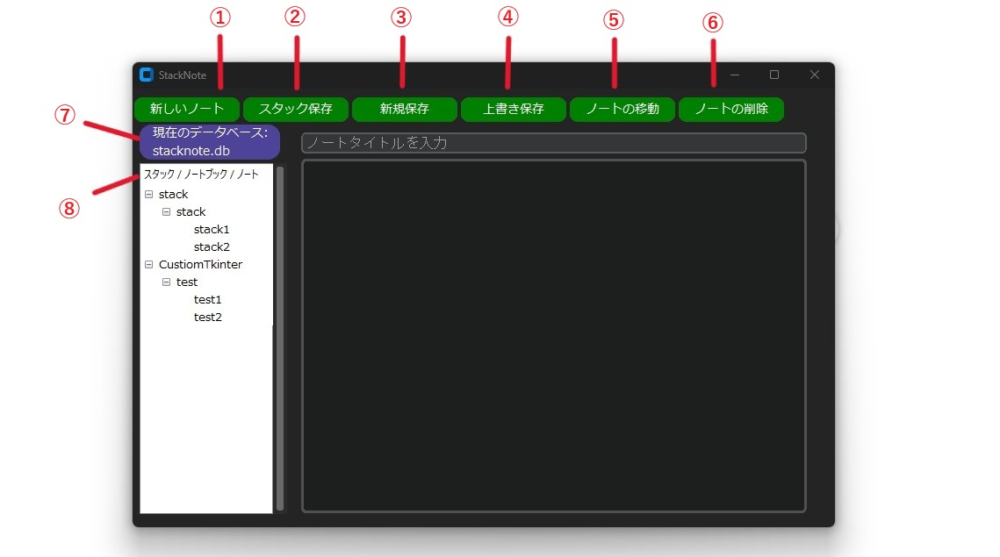

# プロジェクト名
CustomTkinter-SQLite-Note-Taking-App


## 概要
文章をローカルで作成・整理しやすいシンプルなノートの作成


## 主な機能
1. **新しいノート**
   - 空のタイトルとノートを表示
   - 保存前の編集状態

2. **スタック保存**
   - ノートを新しい「スタック」として保存
   - 未入力時、自動で「stack1」「stack2」などの名前を付与

3. **新規保存**
   - 指定したスタックやノートブック名で保存
   - 既存のスタックに追加可能

4. **上書き保存**
   - 編集内容を既存ノートに保存

5. **ノートの移動**
   - 他のスタックやノートブックに移動（複数選択対応）

6. **ノートの削除**
   - 選択したノートを削除（複数選択対応）

7. **現在のデータベース**
　- 現在作業中のデータベースを表示。
　- デフォルトでは「stacknote.db」がアプリケーションの実行ディレクトリに自動生成する
　- データベースのファイル名の変更は可能ですが、ファイル名は「stack」で始める必要があり
　- クリックして、別のデータベースファイルを選択し切り替え可能

8. **ソート機能**
   - ツリービューのヘッダークリックで昇順・降順を切替可能

  


## プロジェクトの構造
- stacknote：メインアプリケーションコード
- message_box：メッセージ関連のモジュール
- db_operation：データベース関連のモジュール

アプリを実行する時は、全てのプロジェクトファイルが同じディレクトリ内である必要がある


## 必要条件
- OS：Windows 10/11（64ビット版推奨）
- Python：3.6以降推奨
- 必要なライブラリ: customtkinter


## セットアップ手順
1. **Pythonをインストール**
   - [公式サイト](https://www.python.org/)からPython 3.6以降をインストール

2. **ターミナルでカレントディレクトリを指定**
　- ターミナル（コマンドプロンプト）で、アプリケーションのディレクトリに移動
   ```bash
   cd C:\[ディレクトリの絶対パス]　

3. **必要なライブラリをインストール**
   ```bash
   pip install customtkinter

4. **メインアプリケーションコードを実行**
   ```bash
   python stacknote.py


## ライセンス
- MIT License

